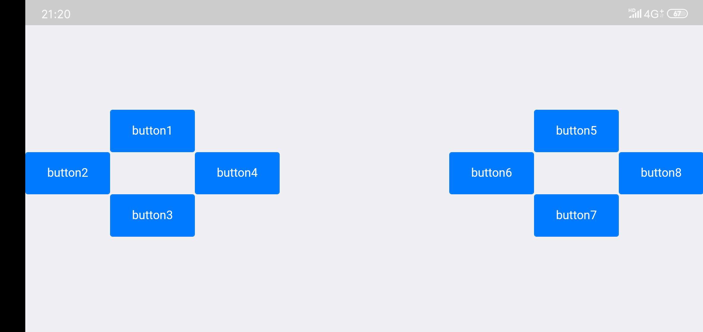
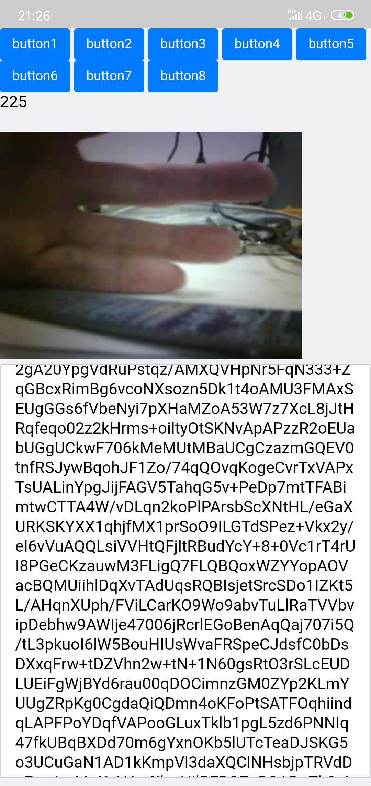

# bad_car_APP
 小破车的手机App
 
 ### 2019-08-01第一次更新，按键布尔控制，模块要先连接手机，并发送信息在软件是获得ip和端口之后才能 操作


### 2019-08-05第二次更新，为了方便调试，将css样式全部注释
####更新内容为
####1、可以将图片上传并显示到手机上，上传格式为上传之前，下面是当时截图
```
上传格式，先发送字符串"beginJpg",在发送图片数据，可以分包发送，发送结束后发送字符串"endJpg"
socket_send("beginJpg",8);
socket_send(p,ov2640_data_len*4);
socket_send("endJpg",6);
```

### 2019-08-06第三次更新，
1、修改了上一个版本只能接收和显示图片的问题，发送到设备的时候程序出现异常
2、添加了电机驱动按钮，目前可以驱动电机和机械臂4个舵机，
3、程序有时候会闪退，目前还不知道是什么原因，可能是接收图片有时候过长导致数组越界
